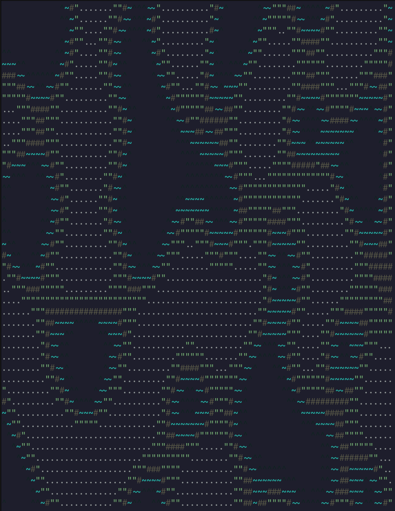
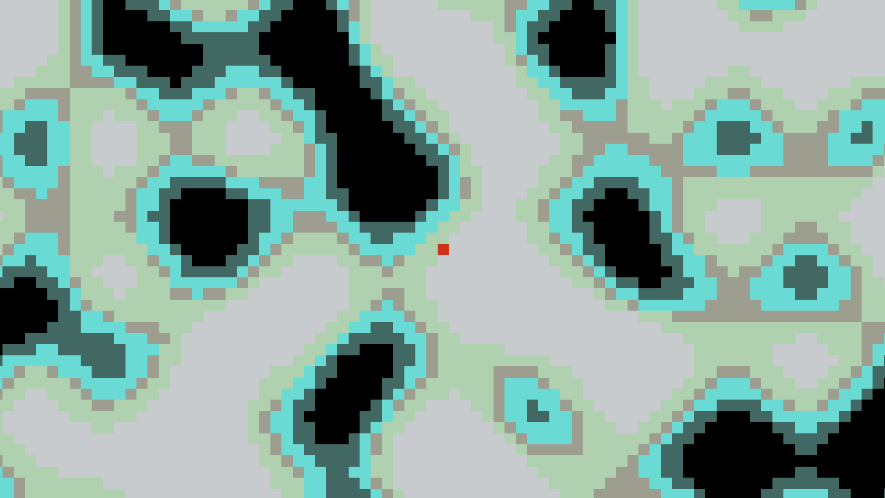

# Bevy 2D Procedural Content Generation World

This project demonstrates a minimal working 2D procedural world made using the Bevy game engine and Rust language that can be used as a kickstarter for anyone who likes to build 2D grid-based procedural generation games.  

  

## Tool

- Engine: Bevy 0.19.0
- Language: Rust 1.95.0
- Package Manager: Cargo 1.95.0

## Project Structure

```text
.
├── assets/
│   ├── tiles/
│   │   └── white.png
├── src/
│   ├── ascii/
│   │   ├── mod.rs
│   │   ├── plugins.rs
│   │   ├── resources.rs
│   │   └── systems.rs
│   ├── game/
│   │   ├── camera/
│   │   │   ├── mod.rs
│   │   │   └── systems.rs
│   │   ├── control/
│   │   │   ├── mod.rs
│   │   │   └── systems.rs
│   │   ├── player/
│   │   │   ├── components.rs
│   │   │   └── mod.rs
│   │   ├── components.rs
│   │   ├── constants.rs
│   │   ├── mod.rs
│   │   ├── plugins.rs
│   │   ├── resources.rs
│   │   ├── systems.rs
│   │   └── utils.rs
│   ├── helper/
│   │   ├── math.rs
│   │   └── mod.rs
│   ├── pcg/
│   │   ├── terrain/
│   │   │   ├── constants.rs
│   │   │   ├── mod.rs
│   │   │   ├── resources.rs
│   │   │   ├── systems.rs
│   │   │   ├── tile.rs
│   │   │   └── utils.rs
│   │   └── mod.rs
│   └── main.rs
├── Cargo.toml
```

## Running

There are 2 ways to visualize the generated world:

1. Window  
2. Terminal ASCII  

### Window

```
cargo run
```



### Terminal ASCII

```
cargo run -- --ascii
```


## Flags

- `--no-collision`: Turn off collision checking
- `--seed <seed_value>`: Generate the world with a seed value \[0, 4294967295\]
- `--ascii`: Run the generation in Terminal ASCII view

**Example:**  

```
# Runs the demo in ASCII mode, with generation seed = 69 and no collision
cargo run -- --no-collision --seed 69 --ascii
```

## Input Mapping

- `w/s/a/d` to move around the generated world
- In Terminal ASCII mode, press `q` to quit
